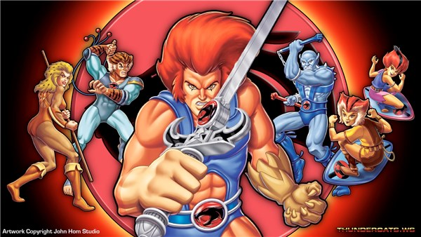
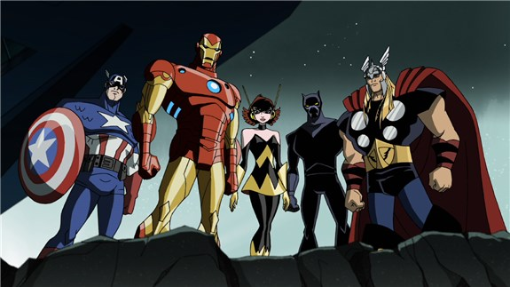

name: inverse
layout: true
class: center, middle, inverse
---
name: center
layout: true
class: center, middle
---
name: normal
layout: true
class: left
---
name: outline
layout: true
class: inverse, middle
---
template: inverse

---
template: inverse
# .blue.bold[Ecology] of Test Strategy

---
template: normal

.left-column[
# Ecology
]
.right-column[
.right[
  ### Organisms
  ### Interactions 
  ### Diversity
  ### Process 
  ### Evolutionary 
  ### Adaptation 
]
]
---
template: normal

.left-column[
# Ecology of Test Strategy 
]
.right-column[
.right[
  ### Need/Context 
  ### Product Elements
  ### Time 
  ### Location
  ### People
]
]

---
template: inverse
# Ecology of Test Strategy 
# .myremark.blue[Applied]
---
template: center

# Thundercats

---
template: normal
.left-column[
	##.blue.myremark[A cat in the team noticed...]
]
.right-column[
<table cellspacing='0'>
    <tbody>

        <tr>
            <td class="myspecialcells">Need/Context</td>
            <td>Customized services.</td>
        </tr><!-- Table Row -->

        <tr class="even">
            <td class="myspecialcells">Product Elements</td>
            <td>1 product in simple landscape.</td>
        </tr><!-- Darker Table Row -->

        <tr>
            <td class="myspecialcells">Time</td>
            <td>Stable releases with medium pressure.</td>
        </tr><!-- Table Row -->

        <tr class="even">
            <td class="myspecialcells">Location</td>
            <td>Team distributed and client location had no impact.</td>
        </tr><!-- Darker Table Row -->

        <tr>
            <td class="myspecialcells">People</td>
            <td>2 global distributed teams, 1 PM, light governance.</td>
        </tr><!-- Table Row -->

        <tr class="conclusion">
            <td class="myspecialcells">Impact on TS</td>
            <td>Strategy impacted by functionality. 
            Basic set of risks associated and fuctionality based strategy. 
            Pragmatic reporting.
            Accepted by Team.</td>
        </tr><!-- Darker Table Row -->

    </tbody>
</table>
]

---
template: center

# Avengers

---
template: normal
.left-column[
	##.blue.myremark[Hulk: Well I don't get everytime what I want...]
]
.right-column[
<table cellspacing='0'>
    <tbody>

        <tr>
            <td class="myspecialcells">Need/Context</td>
            <td>Customized services.</td>
        </tr><!-- Table Row -->

        <tr class="even">
            <td class="myspecialcells">Product Elements</td>
            <td>Multiple products to give a combined service in complex landscape.</td>
        </tr><!-- Darker Table Row -->

        <tr>
            <td class="myspecialcells">Time</td>
            <td>Big bang releases with high pressure.</td>
        </tr><!-- Table Row -->

        <tr class="even">
            <td class="myspecialcells">Location</td>
            <td>4 location rollout.</td>
        </tr><!-- Darker Table Row -->

        <tr>
            <td class="myspecialcells">People</td>
            <td>4 distributed teams, 3 PM shifts, heavy governance.</td>
        </tr><!-- Table Row -->

        <tr class="conclusion">
            <td class="myspecialcells">Impact on TS</td>
            <td>Strategy impacted by location, governance and landscape. Risk basked strategy on functionality and infrastructure. 
            Different per type of client on level of planning, documentation. Acceptance varied on client and PM involved. 
            </td>
        </tr><!-- Darker Table Row -->

    </tbody>
</table>
]

---
template: center

# X-Men

---
template: normal
.left-column[
  ##.blue.myremark[Professor X saw it coming...]
]
.right-column[
<table cellspacing='0'>
    <tbody>

        <tr>
            <td class="myspecialcells">Need/Context</td>
            <td>Funneled information to 1 solution.</td>
        </tr><!-- Table Row -->

        <tr class="even">
            <td class="myspecialcells">Product Elements</td>
            <td>One product in simple landscape.</td>
        </tr><!-- Darker Table Row -->

        <tr>
            <td class="myspecialcells">Time</td>
            <td>Stable frequent releases with medium pressure.</td>
        </tr><!-- Table Row -->

        <tr class="even">
            <td class="myspecialcells">Location</td>
            <td>15 locations funnelling and receiving.</td>
        </tr><!-- Darker Table Row -->

        <tr>
            <td class="myspecialcells">People</td>
            <td>1 team,3 PM shifts, varying governance.</td>
        </tr><!-- Table Row -->

        <tr class="conclusion">
            <td class="myspecialcells">Impact on TS</td>
            <td> Strategy impacted by time, functionality and location. Pragmatic and flexible documentation. Priority based strategy. </td>
        </tr><!-- Darker Table Row -->

    </tbody>
</table>
]

---
template: center

 
<table cellspacing='0'> <!-- cellspacing='0' is important, must stay -->

    <!-- Table Header -->
    <thead>
        <tr>
            <th></th>
            <th class="blue">Thundercats</th>
            <th class="blue">Avengers</th>
            <th class="blue">X-Men</th>
        </tr>
    </thead>
    <!-- Table Header -->

    <!-- Table Body -->
    <tbody>

        <tr>
            <td class="myspecialcells">Need/Context</td>
            <td>Customized services.</td>
            <td>Customized services.</td>
            <td>Funneled information to 1 solution.</td>
        </tr><!-- Table Row -->

        <tr class="even">
            <td class="myspecialcells">Product Elements</td>
            <td>1 product in simple landscape.</td>
            <td>Multiple products to give a combined service in complex landscape.</td>
            <td>1 product in simple landscape.</td>
        </tr><!-- Darker Table Row -->

        <tr>
            <td class="myspecialcells">Time</td>
            <td>Stable releases with medium pressure.</td>
            <td>Big bang releases with high pressure.</td>
            <td>Stable frequent releases with medium pressure.</td>
        </tr><!-- Table Row -->

        <tr class="even">
            <td class="myspecialcells"> Location</td>
            <td>Team distributed and client location had no impact.</td>
            <td>4 location rollout.</td>
            <td>15 locations funnelling and receiving.</td>
        </tr><!-- Darker Table Row -->

        <tr>
            <td class="myspecialcells">People</td>
            <td>2 global distributed teams, 1 PM, light governance.</td>
            <td>4 distributed teams,3 PM shifts, heavy governance.</td>
            <td>1 team,3 PM shifts, varying governance.</td>
        </tr><!-- Table Row -->

        <tr class="conclusion">
            <td class="myspecialcells">Impact on TS</td>
            <td>Strategy impacted by functionality.</td>
            <td>Strategy impacted by location, governance and landscape.</td>
            <td>Strategy impacted by time, functionality and location.</td>
        </tr><!-- Darker Table Row -->

    </tbody>
    <!-- Table Body -->

</table>

---

template: inverse
# Wisdom of the day

##  .myremark[It varies...]
### Given the factors you have at hand, test strategies are shaped, altered and is .blue[continuous].
---
template: center   

# Test Strategy -
## .myremark[   " I'm not dead. I mutate ! "]

